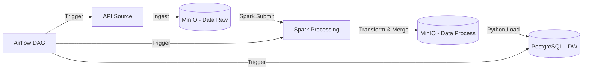

# Game Price Analytics ETL Pipeline

## 📖 Giới thiệu

Dự án này là một hệ thống **ETL (Extract, Transform, Load) Pipeline** tự động hóa việc thu thập, xử lý và lưu trữ dữ liệu về giá game từ các nguồn dữ liệu thô (API/JSON) vào Data Warehouse để phục vụ mục đích phân tích.

Hệ thống được thiết kế để chạy định kỳ hàng ngày, xử lý dữ liệu lớn bằng Apache Spark và đảm bảo tính toàn vẹn dữ liệu khi nạp vào PostgreSQL.

## 🏗 Kiến trúc hệ thống

Hệ thống hoạt động theo mô hình **Lakehouse** đơn giản hóa:

1.  **Ingestion Layer**: Dữ liệu thô (Deals, Games, Stores) được thu thập và lưu trữ vào **MinIO** (Data Lake) dưới dạng JSON.
2.  **Processing Layer**: **Apache Spark** đọc dữ liệu JSON, thực hiện làm sạch, kết nối (join) các bảng dimension và fact, sau đó ghi ra file CSV Master.
3.  **Serving Layer**: Python script đọc dữ liệu đã xử lý từ MinIO và nạp vào **PostgreSQL** (Data Warehouse), có kiểm tra trùng lặp (Incremental Load).
4.  **Orchestration**: **Apache Airflow** điều phối toàn bộ quy trình.

### Sơ đồ luồng dữ liệu (Data Flow)



## 🛠 Công nghệ sử dụng

-   **Ngôn ngữ**: Python 3.x, SQL.
-   **Orchestrator**: Apache Airflow.
-   **Data Processing**: Apache Spark (PySpark).
-   **Storage (Data Lake)**: MinIO (S3 Compatible).
-   **Data Warehouse**: PostgreSQL.
-   **Containerization**: Docker.
-   **Libraries**: `pyspark`, `pandas`, `sqlalchemy`, `minio`, `psycopg2`.

## 📂 Cấu trúc dự án

```text
test_final_project_de/
├── dags/
│   └── game_price_pipeline.py    # Airflow DAG định nghĩa luồng chạy (9:00 AM daily)
├── scripts/
│   ├── ingest_data.py            # Script thu thập dữ liệu (API -> MinIO)
│   ├── transform_data.py         # Spark Job: Xử lý JSON, Join bảng, tạo Master CSV
│   ├── load_to_postgres.py       # Load dữ liệu từ MinIO vào Postgres (Incremental)
│   └── config.py                 # Cấu hình kết nối (MinIO, DB credentials)
├── jars-custom/                  # Các thư viện Java cho Spark kết nối S3/MinIO
└── README.md                     # Tài liệu dự án
```

## ⚙️ Logic xử lý chi tiết

### 1. Transform (Spark)
-   **Input**: Đọc file JSON từ `s3a://data-raw/{date}/` (Deals, Games, Stores).
-   **Logic**:
    -   Chỉ xử lý các thư mục ngày mới hơn ngày trong file Master hiện tại.
    -   Join dữ liệu: `Deals` (Fact) LEFT JOIN `Games` (Dim) và `Stores` (Dim).
    -   Làm sạch: Cast kiểu dữ liệu (Float, Date, Boolean).
    -   Gộp dữ liệu mới vào file `master_game_prices.csv`.
-   **Output**: Lưu lại vào `s3a://data-process/game_prices/`.

### 2. Load (Postgres)
-   **Input**: Đọc các file CSV từ `s3a://data-process/game_prices/`.
-   **Logic**:
    -   Lấy danh sách `deal_id` và `date` đã có trong Database.
    -   So sánh dữ liệu từ file CSV với Database.
    -   Chỉ insert các dòng chưa tồn tại (Deduplication).
-   **Output**: Table `game_prices` trong PostgreSQL.

## 📊 Schema dữ liệu (Data Warehouse)

Bảng `game_prices` bao gồm các trường chính:

| Column Name | Type | Description |
|-------------|------|-------------|
| deal_id | String | ID duy nhất của deal |
| game_title | String | Tên game |
| sale_price | Float | Giá khuyến mãi |
| original_price | Float | Giá gốc |
| store_name | String | Tên cửa hàng (Steam, Epic, etc.) |
| rating | Integer | Đánh giá từ người dùng |
| metacritic_score | Integer | Điểm Metacritic |
| release_date | Date | Ngày phát hành game |
| date | Date | Ngày thu thập dữ liệu |

## 🚀 Hướng dẫn chạy

### Yêu cầu
-   Docker & Docker Compose đã được cài đặt.

### Các bước thực hiện

1.  **Khởi động hệ thống**:
    ```bash
    docker-compose up -d --build
    ```

2.  **Truy cập Airflow UI**:
    -   Mở trình duyệt tại `http://localhost:8080`.
    -   Tìm DAG `game_price_analytics`.
    -   Bật DAG (Unpause) để hệ thống chạy theo lịch (09:00 hàng ngày) hoặc Trigger thủ công.